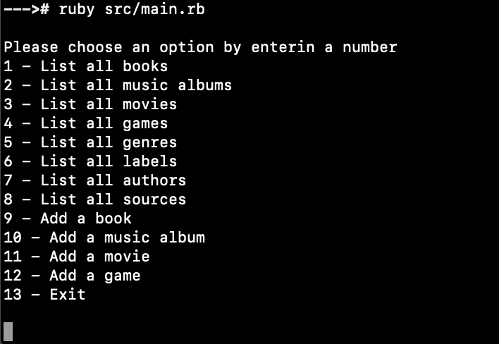

# Catalog of my things

> Use Ruby to create an app with the command line.

# Video Presentation:

https://www.youtube.com/watch?v=6vyVtcpuyu8

## Built With

- Ruby
- VScode
- Git & GitHub

## Getting Started

To get a local copy up and running follow these simple example steps.

- Open your command line

- Go to the directory where you want this project to be cloned into

- Run this command:
  `git clone https://github.com/eri8-9/Catalog_of_my_things`

- cd into the directory

- run the main.rb file (if you are on windows you just need to run `main` in other systems you need to run `ruby src/main.rb`)

## Authors

👤 **Tiago Rahal Aires**

- [GitHub](https://github.com/tiagorahal)
- [LinkedIn](https://www.linkedin.com/in/tiagorahal/)

👤 **Christian Erick Contreras**

- [GitHub](https://github.com/eri8-9)
- [LinkedIn](https://www.linkedin.com/in/christian-erick/)
- [Twitter](https://twitter.com/ChristianErick_)

## 🤝 Contributing

Contributions, issues, and feature requests are welcome!

Feel free to check the [issues page](https://github.com/tiagorahal/school-library/issues).

## Show your support

Give a ⭐️ if you like this project!

## 📝 License

This project is [MIT](./LICENSE) licensed.
